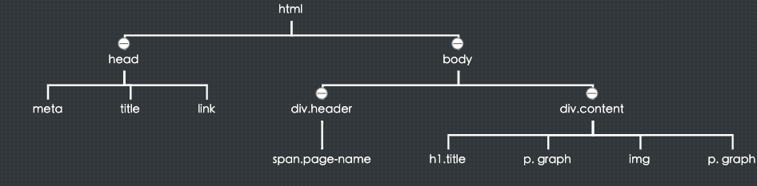
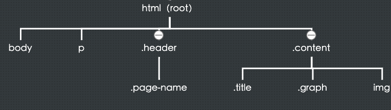
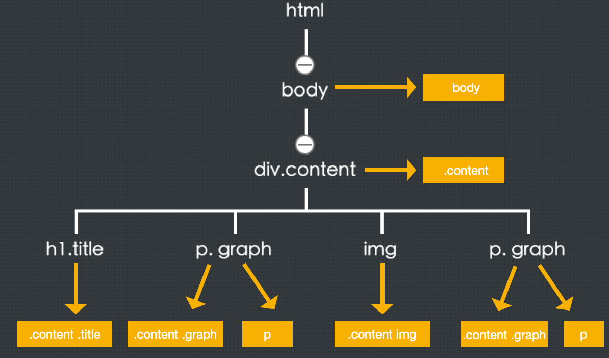

# DOM树和CSSOM树的构建

## 页面加载和渲染过程
常见的一道面试题，从浏览器出入一个url到页面展示，其中经历了什么。 

这里只讨论HTML回来后浏览器解析的部分，一个HTML文本文件怎么就能变成最终我们看到的页面
- 1、HTML的加载
  输入一个url，最先拿到的一般都是一个HTML文件，这是一个网页的基础，下载完HTML文件就会对其进行解析。

- 2、其它静态资源下载
  在解析HTML的时候，会遇到一些外部资源链接，比如CSS，JS，图片等，就会立即启用一个别的线程来下载这些资源。有一个注意点是，我们都知道加载JS会阻塞dom的渲染，这么做的原因是JS可以改变DOM，所以有可能你渲染一般，JS把整个结构变了，就白渲染了，所以干脆等JS加载完了，再去解析HTML
- 3、HTML解析
  在html解析的同时，浏览器会把解析好的html转化为DOM对象。
- 4、CSSOM(渲染树)构建
  css下载完后，会在开一个线程来解析css，同样解析成一颗树，叫做CSSOM
- 5、render tree (渲染树)
  当DOM树和CSSOM树都构建完成后，就会将两颗树组合成一颗树，我们叫做render
- 6、渲染
  当render tree准备好之后。浏览器就会根据这颗树进行解析，绘制页面了
- 注意
  浏览器对于上面的过程是一个流的方式进行的，边加载边解析边渲染，下载一些，就开始进行解析，解析一部分就开始渲染，就类似于后端的流处理。 

DOM树图示

CSSOM图示

render tree图示

