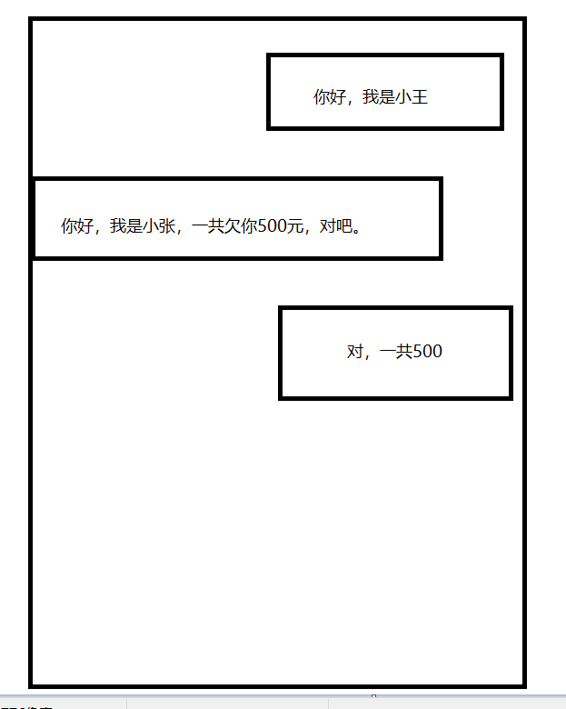
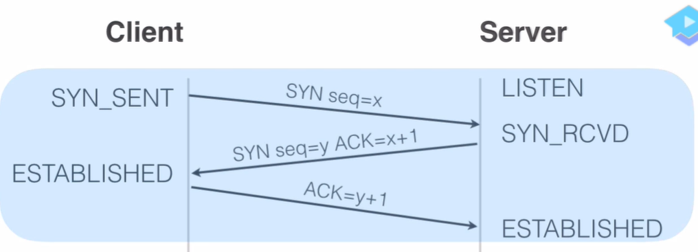

## TCP连接特点
- 三次握手
- 四次挥手
- 可靠连接
- 丢包重传

TCP最重要的特点是：TCP是一种可靠的传输协议，什么三次握手，四次挥手都是为了可靠性服务。

## 转账情景
假如A和B要进行一次微信转账交易，转账之前俩人是不是需要确认一下身份(seq)以及转账金额(ack)。 
  

## 三次握手
TCP的三次握手就类似于上面转账的流程，转之前要确认一下双方身份，金额。三次流程如下：
- 第一步：客户端发送SYN seq(小王)到服务端。
- 第二步：服务端收到后回复SYN seq(小张)和ack(500元)等信息到客户端。
- 第三步：客户端回复服务端ack(500元)表示确认连接。

如下图：

