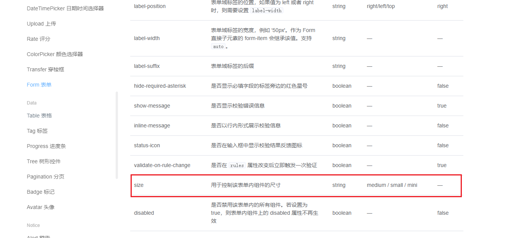

el-button组件是我们最常用的组件之一，源码也比较简单，上节介绍过，主要是通过slot承接组件内容，其余就是一些样式问题<br/>

有一个注意点就是el-button中size，disabled等属性的设置，先看以下代码：
```vue
<script>
export default {
  name: '',
  inject: {
    elForm: {
      default: ""
    },
    elFormItem: {
      default: ""
    }
  },
  computed: {
    _elFormItemSize() {
      return (this.elFormItem || {}).elFormItemSize;
    },
    buttonDisabled() {
      return this.disabled || (this.elForm || {}).disabled;
    },
    buttonSize() {
      return this.size || this._elFormItemSize || (this.$ELEMENT || {}).size;
    }
  },
}
</script>
```
再来看一下form表单中关于size的介绍

通过在form表单中设置size就能控制整个form表单下所有元素的大小，包括button，input，select等。<br/>
原理就是利用vue的[provide/inject](https://cn.vuejs.org/v2/api/#provide-inject)属性，在button中通过inject获取到form中设置的size，disabled等属性。<br/>

下面以buttonSize举例来说明。buttonDisabled等同理：
```js
_elFormItemSize() {
  return (this.elFormItem || {}).elFormItemSize;
},
buttonSize() {
  return this.size || this._elFormItemSize || (this.$ELEMENT || {}).size;
}
```
button组件先会获取自身设置的size属性，获取不到就去elFormItem中获取，elFormItem同理，也是先在自身组件获取，获取不到就去elForm获取。<br/>
在buttonSize最后，我们注意到还有个this.$ELEMENT属性，这个是element-ui的[全局配置](https://element.eleme.cn/2.13/#/zh-CN/component/quickstart)。
```js
import Vue from 'vue';
import Element from 'element-ui';
Vue.use(Element, { size: 'small', zIndex: 3000 });
```
this.$ELEMENT就是获取element-ui全局配置中的size属性。<br/>
总结，给el-button设置size的优先级分别为：<br/>
自身size属性 > elFormItem中设置的size > elForm中设置的size属性 > 全局size属性
