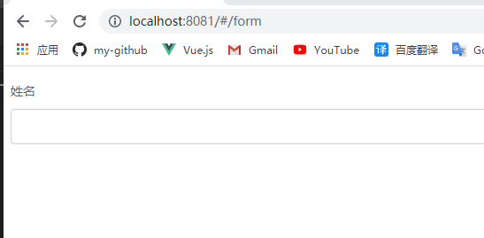

用element-ui的肯定用过form组件，form组件我准备分两部分，基本结构介绍以及规则校验。最终实现如下功能。<br/>


## 目录结构
element-ui/packages目录下：
```bash
|—— form
    |—— src
        |—— form.vue                            // form组件
        |—— form-item.vue                       // form-item组件
        |—— label-wrap.vue                      // label组件
        |—— index.js                            // 导出form组件
|—— form-item
    |—— index.js                                // 导出form-item组件
```

## 基础代码
form组件结构:
```vue
<template>
  <form class="el-form">
    <slot></slot>
  </form>
</template>
```
form-item组件结构:
```vue
<template>
  <div class="el-form-item">
    <!-- label -->
    <label class="el-form-item__label">
      <!-- label插槽 -->
      <slot name="label">{{ label }}</slot>
    </label>
    <div class="el-form-item__content">
      <!-- 内容 -->
      <slot></slot>
      <!-- 错误信息 -->
      <transition name="el-zoom-in-top">
        <!-- error插槽 -->
        <slot name="error">
          <div class="el-form-item__error" name="error">
            {{ validateMessage }}
          </div>
        </slot>
      </transition>
    </div>
  </div>
</template>

<script>
export default {
  name: "ElFormItem",
  props: {
    label: String,
  },
  data() {
    return {
      validateMessage: "",        // 错误信息
    };
  },
};
</script>
```

使用如下：
```html
<el-form :model="model" :rules="rules">
  <el-form-item label="姓名" prop="name">
    <el-input v-model="model.name"></el-input>
  </el-form-item>
</el-form>
```
效果：<br/>

基本架子搭起来，接下来填充内容。

## label-width
el-form和el-form-item都可以设置label-width，el-form-item先会从自身寻找labelWidth，没有的话就会继承el-form中设置的labelWidth。并且支持auto<br/>


#### Form Attributes
| 参数      | 说明          | 类型      | 可选值                           | 默认值  |
|---------- |-------------- |---------- |--------------------------------  |-------- |
| label-width | 表单域标签的宽度，例如 '50px'。作为 Form 直接子元素的 form-item 会继承该值。支持 `auto`。 | string | — | — |

#### Form-Item Attributes
| 参数      | 说明          | 类型      | 可选值                           | 默认值  |
|---------- |-------------- |---------- |--------------------------------  |-------- |
| label-width | 表单域标签的的宽度，例如 '50px'。支持 `auto`。 | string |       —       | — |

除auto外，实现起来也比较简单，el-form-item组件中动态添加class：
```html
<!-- label -->
<label class="el-form-item__label" :style="labelWidth">
  <!-- label插槽 -->
  <slot name="label">{{ label }}</slot>
</label>
```
```js
export default {
  props: {
    label: String
  },
  computed: {
    form() {
      let parent = this.$parent;
      let parentName = parent.$options.componentName;
      
    }
  }
}
labelStyle() {
  const ret = {};
  const labelWidth = this.labelWidth || this.form.labelWidth;
}
```