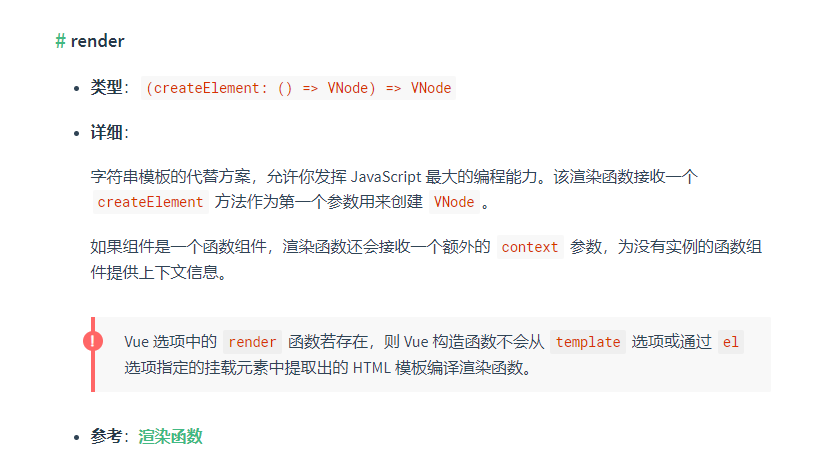
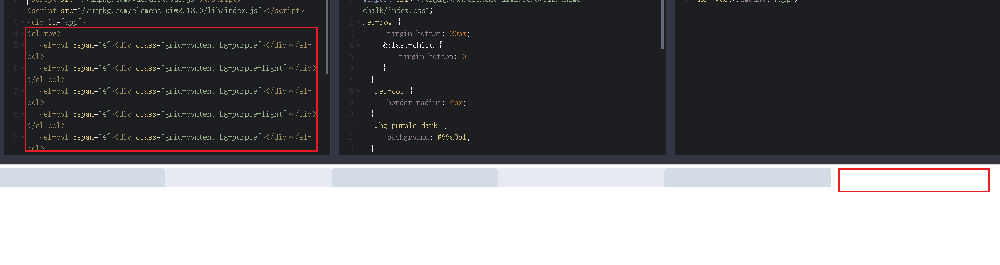
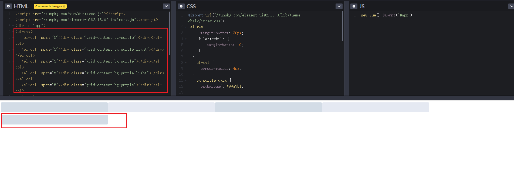
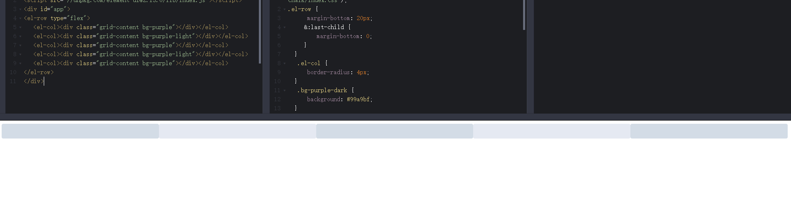
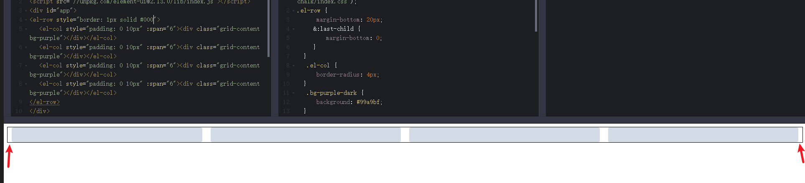

# layout布局组件
布局组件一共分为两个组件，`el-row`和`el-col`组件。

## el-row
`el-row`和`el-col`两个组件都是[函数式组件](https://cn.vuejs.org/v2/guide/render-function.html#%E5%87%BD%E6%95%B0%E5%BC%8F%E7%BB%84%E4%BB%B6)，不熟悉的可以先去了解一下vue的[渲染函数 & JSX](https://cn.vuejs.org/v2/guide/render-function.html)，这样设计的好处是可以通过`tag`属性支持自定义标签。<br/>

### render函数
先来看一下vue官网对于render函数的介绍

render函数接收一个createElement方法，第一个参数为我们要渲染的html模板，举例：
```js
// 比如我们要渲染<h1>hello world</h1>，用render函数写法如下
render(createElement) {
  return createElement('h1', 'hello world')
}
// 第二个参数支持对象形式，并且可以传入class，style，attrs，props等属性。
// 具体支持哪些属性，看vue官方文档(https://cn.vuejs.org/v2/guide/render-function.html#createElement-%E5%8F%82%E6%95%B0)
render(createElement) {
  return createElement('h1', {
    style: {
      color: 'red'
    },
    class: ['el-row'],
    domProps: {
      innerHTML: 'hello world'
    }
  })
}
// 渲染结果：<h1 class="el-row" style="color: red">hello world</h1>
```
createElement还支持传入Array，以及子级虚拟节点等，具体的好好去官网文档看一看[渲染函数 & JSX](https://cn.vuejs.org/v2/guide/render-function.html)章节文档。

### el-row组件中的render函数
如果你看懂了上面关于render函数的介绍后，在来看`el-row`中的render函数，应该很容易就看懂了。
```js
render(h) {
  return h(this.tag, {
    class: [
      'el-row',
      this.justify !== 'start' ? `is-justify-${this.justify}` : '',
      this.align !== 'top' ? `is-align-${this.align}` : '',
      { 'el-row--flex': this.type === 'flex' }
    ],
    style: this.style
  }, this.$slots.default);
}
```
`el-row`之所以用函数式组件来实现，就是为了`this.tag`可以根据传入的标签渲染成不同的dom元素。
第二个参数传入了一个对象，用来设置class，style等。<br/>
第三个参数通过vue的`$slots.default`获取到插槽中的内容。

### type属性
`element-ui`实现了类似`Bootstrap`的栅格布局，`Bootstrap`分了12列，`element-ui`分了24列。大部分情况下能满足，但是假如子元素有5个的时候，span设置4的话，会有点留白，设置5的话，有一列就跑下面去了，如下图所示：


所以为了布局更加灵活，layout组件支持`flex`布局，使用效果如下：

所以我们可以通过在`el-row`组件中传入`type="flex"`设置为flex布局，并且可以传入`justify`控制flex 布局下的水平排列方式，
`align`控制flex 布局下的垂直排列方式。

### gutter属性
`el-row`中可以通过gutter属性来设置栅格间隔。实现原理是通过给`el-col`添加左右的padding来实现的，但是有个问题，添加完后，对于第一列和最后一列，左边和右边也会多出`padding/2`大小的间隔，这样是不符合预期的。如下图：

去掉的方式也很简单，我们给`el-row`左右负margin。marginLeft: -10px和marginRight: -10px。这样，在视觉上，我们就去掉了左右留白，在`el-row`源码中对应的部分为:
```js
computed: {
  style() {
    const ret = {};

    if (this.gutter) {
      ret.marginLeft = `-${this.gutter / 2}px`;
      ret.marginRight = ret.marginLeft;
    }

    return ret;
  }
}
```

## el-col
`el-col`组件js部分整体也比较简单，先来看gutter属性的设置。
### gutter
```js
computed: {
  gutter() {
    let parent = this.$parent;
    while (parent && parent.$options.componentName !== 'ElRow') {
      parent = parent.$parent;
    }
    return parent ? parent.gutter : 0;
  }
}
render(h) {
  let style = {};
  if (this.gutter) {
    style.paddingLeft = this.gutter / 2 + 'px';
    style.paddingRight = style.paddingLeft;
  }
}
```
先通过`this.$parent`获取到`el-row`中`gutter`属性的值，然后分别添加`paddingLeft`和`paddingRight`为`gutter`的一半。

### span
span控制栅格占据的列数，通过审查元素发现，不同span值对应不同的class，不同的class对应不同的宽度百分比，比如：
```md
<el-col :span="12"></el-col>
<!-- 渲染结果为 -->
<div class="el-col el-col-12"></div> 
<!-- .el-col-12 { width: 50% } -->

<el-col :span="6"></el-col>
<!-- 渲染结果为 -->
<div class="el-col el-col-6"></div> 
<!-- .el-col-12 { width: 25% } -->

<el-col :span="4"></el-col>
<!-- 渲染结果为 -->
<div class="el-col el-col-4"></div> 
<!-- .el-col-12 { width: 16.66667% } -->
```
同时还可以通过设置offse(栅格左侧的间隔格数)和push(栅格向右移动格数)等来控制栅格的位置。<br/>
具体到代码中的实现为：
```js
render(h) {
  let classList = [];

  ['span', 'offset', 'pull', 'push'].forEach(prop => {
    if (this[prop] || this[prop] === 0) {
      classList.push(
        prop !== 'span'
          ? `el-col-${prop}-${this[prop]}`
          : `el-col-${this[prop]}`
      );
    }
  });
}
```
另外layout布局还支持响应式布局，设计了五个尺寸: `xs`、`sm`、`md`、`lg`、`xl`<br/>
具体实现也是通过添加不同的class类来实现，代码如下：
```js
render(h) {
  let classList = [];

    ['xs', 'sm', 'md', 'lg', 'xl'].forEach(size => {
      if (typeof this[size] === 'number') {
        classList.push(`el-col-${size}-${this[size]}`);
      } else if (typeof this[size] === 'object') {
        let props = this[size];
        Object.keys(props).forEach(prop => {
          classList.push(
            prop !== 'span'
              ? `el-col-${size}-${prop}-${props[prop]}`
              : `el-col-${size}-${props[prop]}`
          );
        });
      }
    });
}
```
处理方式和上面`span`、`offset`等一样。

看完了js部分，我们在来看一下`element-ui`中`layout`组件的css是如何写的

### css
前面章节说过，element-ui的css都放到`pacakge/theme-chalk`文件下面，并且是通过sass预处理器来写的。<br/>

在`el-col`中，我们通过设置span属性，就能为元素添加不同的class，比如:
```md
span="12" class="el-col-12"
span="6" class="el-col-6"
span="4" class="el-col-4"
```
那对应的在css中就应该有：
```css
.el-col-0 {
  width: 0%;
}

.el-col-1 {
  width: 4.1666666667%;
}

.el-col-2 {
  width: 8.3333333333%;
}

...

.el-col-23 {
  width: 95.8333333333%;
}

.el-col-24 {
  width: 100%;
}
```
显然，如果这么直接写25个class的样式不太明智，又多，又乱，而且将来改起来也不方便，所以在`element-ui`中用到了``scss``的`控制指令`，只需要如下一段代码，通过sass编译后就能直接生成上面的css：
```scss
@for $i from 0 through 24 {
  .el-col-#{$i} {
    width: (1 / 24 * $i * 100) * 1%;
  }
}
```
另外在element-ui中写了好多个通用的`mixins`，比如：
```scss
// 作用：因为element-ui中大部分class都是以el开头，调用这个mixin就会帮你自动添加el-前缀
@mixin b($block) {
  $B: $namespace+'-'+$block !global;

  .#{$B} {
    @content;
  }
}
// 使用
@include b(row) {
  position: relative;
  box-sizing: border-box;
}
// 转换结果
.el-row {
  position: relative;
  box-sizing: border-box;
}
```
在比如：
```scss
@mixin m($modifier) {
  $selector: &;
  $currentSelector: "";
  @each $unit in $modifier {
    $currentSelector: #{$currentSelector + & + $modifier-separator + $unit + ","};
  }

  @at-root {
    #{$currentSelector} {
      @content;
    }
  }
}

// 使用
@include b(row) {
  position: relative;
  box-sizing: border-box;

  @include m(flex) {
    display: flex;
  }
}

// 编译结果
.el-row {
  position: relative;
  box-sizing: border-box;
}
// 参考BEM规范(https://github.com/Tencent/tmt-workflow/wiki/%E2%92%9B-%5B%E8%A7%84%E8%8C%83%5D--CSS-BEM-%E4%B9%A6%E5%86%99%E8%A7%84%E8%8C%83)
.el-row--flex {
  display: flex;
}
```
你可能会好奇，我写了这么一堆乱七八糟的东西，最后就位了得到这几行css代码，费这劲干嘛。<br/>

之所以这么干利用`scss`的强大特性，`css in js`。用写js的方式来写css，众所周知，在js中，我们经常通过写一些函数之类的，将某一个复杂重复的工作封装成一个函数，在`scss`中也是，举例：我们通过封装上面两个`mixin`，每次调用就可以自动搬我们加上`el-`前缀，以及`el-xxx--`等前缀，`element-ui`中还有很多有用的`mixin`，比如utils-clearfix等等。
```scss
@mixin utils-clearfix {
  $selector: &;

  @at-root {
    #{$selector}::before,
    #{$selector}::after {
      display: table;
      content: "";
    }
    #{$selector}::after {
      clear: both
    }
  }
}

// 每次需要清除浮动的时候，加下面一句就可以 清除浮动
@include utils-clearfix;
```
`scss`还有很多有意思的属性。感兴趣可以去官方文档中查看，`scss`用好了，项目中的css代码能减少很多