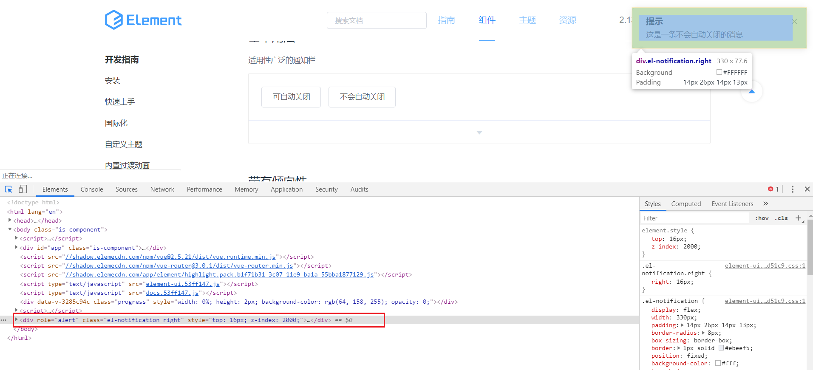
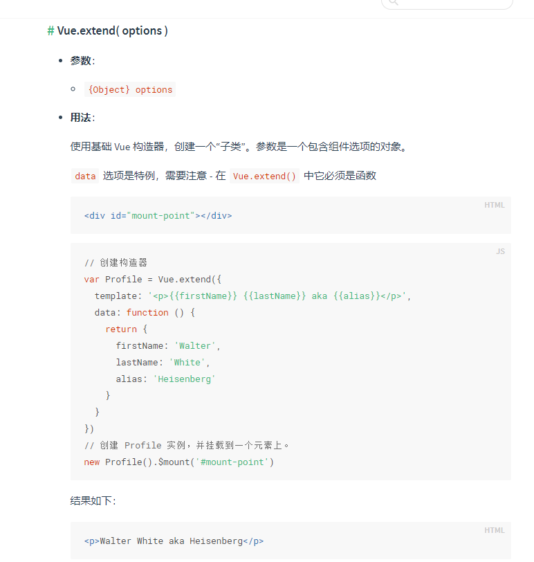
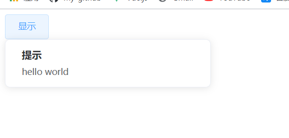
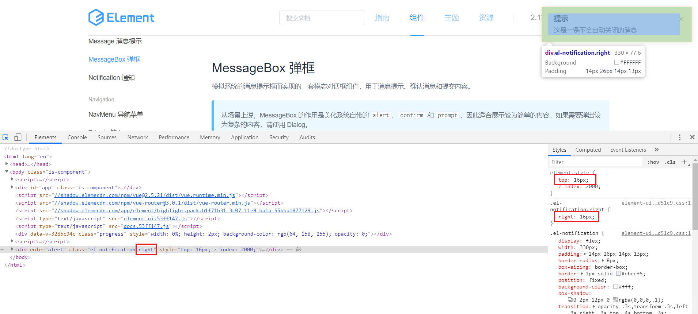
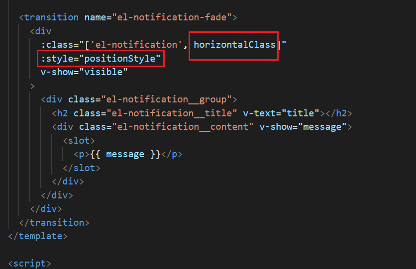
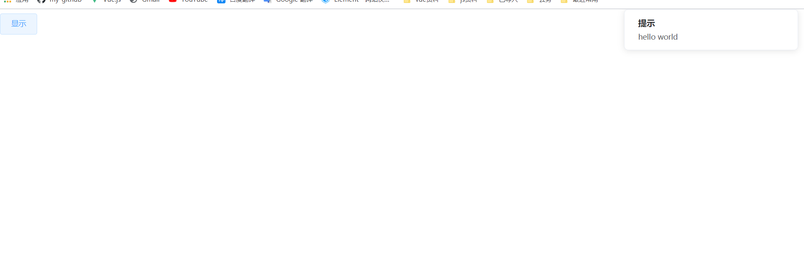
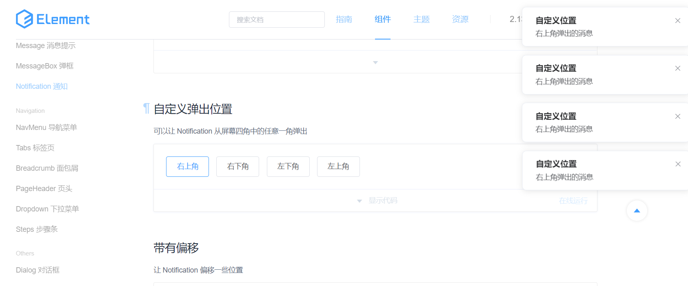

# notify通知组件
在我们项目中，`notify`比较常用，像一些请求失败提示啊之类的，使用也非常简单，一句js就可以：
```js
this.$notify({
  title: '提示',
  message: '成功',
  type: 'success'
})
```
## 分析
我们在使用notify的时候，通过`this`直接调用，所以可以想到，`notify`组件是应该挂载到vue的原型上的，在源码`element-ui/src/index.js`可以看到:
```js
import Notification from '../packages/notification/index.js';
Vue.prototype.$notify = Notification;
```
另外`notify`是个函数，我们在使用的时候，调用一个函数，通过传入一个配置对象就能直接生成一个组件，并且你如果审查元素，会发现是挂载body元素最后面的，如图所示：

不难想到，源码中肯定有一句`document.body.appendChild(el)`。<br/>
一开始我好奇，调用`notify`函数，传入一个对象就能生成一个组件，这种是怎么做到的，看源码的时候，渐渐有了一些理解，简化一下代码如下：
```js
// packages/notification/src/main.js
import Vue from 'vue';
import Main from './main.vue';

const NotificationConstructor = Vue.extend(Main);

let instance;
const Notification = function(options) {
  instance = new NotificationConstructor({
    data: options
  });
  return instance;
}
export default Notification;
```
看着好像是我们通过`this.$notify({})`调用的时候，调用的是`Notification`方法，该方法通过`NotificationConstructor`构造函数`new`一个`instance`实例并返回，在顺着看实例对应的构造函数`NotificationConstructor`，此时就看到了其庐山真面目，`Vue.extend(main)`。


## extend
说实话，如果不是去查看`notify`组件源码，我可能一直不会去关注`Vue.extend()`这个`api`，有些东西，因为不知道，所以在开发遇到某些问题的时候，根本就想不到这个点。<br/>

既然`element-ui`源码中是通过这个实现的，那我们就看一下vue官网对于这个api的[介绍](https://cn.vuejs.org/v2/api/#Vue-extend)<br/>

看着好像和`Vue.component()`第二个参数差不多，果然，在`Vue.component`的`api`中发现这样一段话：
```md
// 注册组件，传入一个扩展过的构造器
Vue.component('my-component', Vue.extend({ /* ... */ }))

// 注册组件，传入一个选项对象 (自动调用 Vue.extend)
Vue.component('my-component', { /* ... */ })
```
看到这里你应该明白了其作用，我在简单总结一下:
```js
// Vue.extend返回一个扩展实例构造器，能帮你预先设定一些选项
let NotificationConstructor = Vue.extend({
  data() {
    return {
      name: 'aaa',
      age: 22
    }
  },
  // 这里可能会报错，提示我们Vue仅运行时版本不支持template，可将模板编译为渲染函数
  // 正好复习一下上节课讲的render函数
  render(h) {
    return h('h1', `姓名：${this.name}  年龄：${this.age}`)
  }
});

// 在使用的时候，直接new一个实例就行，并且可以传入配置对象去覆盖掉Vue.extend中预设的属性
let instance = new NotificationConstructor({
  data: {
    name: 'bbb'
  }
});
// 渲染结果
<h1>姓名：bbb 年龄：22</h1>
```
看完上面的，你应该完全理解`Vue.extend()`这个`api`的用法了。

`Vue.extend`除了上面那样传入一个对象外，也可以传入一个`.vue`组件，这样在写的时候，就更加方便了，不需要写`render`函数或者`template`模板。

下面来正式进入notify源码，探究其内部实现原理。


## 基本实现
notify组件源码位于`element-ui/packages/notification/src/main.js`，简化一下逻辑如下：
```js
import Vue from 'vue';
import Main from './main.vue';
// 这里不用多说了吧，看完上面的你应该了解其作用了
const NotificationConstructor = Vue.extend(Main);

// 当前实例对象，创建在Notification函数外面，是因为在Notification外要用到。
let instance;
const Notification = function(options) {

  // 将我们传入的options拷贝一份。
  // 这里merge方法作用和Object.assign()相同，所以这里为了简化，就用Object.assign替代
  options = Object.assign({}, options);

  instance = new NotificationConstructor({
    data: options
  });
  // 挂载
  instance.$mount();
  // $el是组件生成的dom对象
  document.body.appendChild(instance.$el);
  return instance;
};

export default Notification;
```
`main.js`引用了`main.vue`组件，在来看`main.vue`的，同样我会简化一下代码：
```vue
<template>
  <!-- vue过渡动画，需要配合v-if或者v-show使用 -->
  <transition name="el-notification-fade">
    <div 
      :class="['el-notification']"
      v-show="visible"
    >
      <div class="el-notification__group">
        <h2 class="el-notification__title" v-text="title"></h2>
        <div class="el-notification__content" v-show="message">
          <slot>
            <p>{{ message }}</p>
          </slot>
        </div>
      </div>
    </div>
  </transition>
</template>

<script>

export default {
  data() {
    return {
      visible: false,
      title: '',
      message: ''
    };
  }
};
</script>
```
这里面的代码就比较简单了，没什么好说的。接下来测试，看我们调用this.$notify({ title: '提示', message: 'hello world' })看能否正常显示。
注意入口文件`element-ui/src/index.js`中需要引入组件，并且讲其挂载到vue的原型上。

演示代码
```vue
<template>
  <div>
    <el-button @click="handleClick">显示</el-button>
  </div>
</template>

<script>
export default {
  methods: {
    handleClick() {
      this.$notify({
        title: '提示',
        message: 'hello world',
        type: 'success'
      })
    }
  }
}
</script>
```
点击后发现页面毛也没有，审查元素后发现，组件以及追加到`body`后了，只是`display`设置为`none`，在`main.js`中`document.body.appendChild(instance.$el)`后添加一句：
```js
instance.visible = true;
```
再次点击发现出现了，效果如下：

出来了，但是位置好像不太多，接下来我们调整一下位置。

## position自定义弹框位置
仔细看文档关于position的介绍，是可以设置在页面四个角，默认是在右上角（top-right）。
审查元素看一下:

通过在style中添加top来控制垂直方向，添加right类来控制左右，下面分别来看看在源码中是如何实现的，在main.vue中添加如下代码:


查看效果:

现在就到了正确的位置，它这position的位置设计挺巧妙的，可以好好学习一下。

## 多个notify实例
我们每点击一次，就会弹出一个notify框，并且为之在上一个的下面，如图所示：

那这个是怎么实现的呢，每点击一次我们就会执行一遍Notification，生成一个弹框实例，并且挂载到body后面，这个很简单。难点是新生成的弹框位置如何设置。<br/>

还记得上面我们设置positionStyle的值的时候，源码中是获取verticalOffset的值，我们为了好理解就直接设置为了0，现在改回来，看看源码中是如何动态设置其值的。<br/>
你顺着verticalOffset往上找，发现main.js中有这么一段关于verticalOffset值的代码：
```js
let instances = [];

const position = options.position || 'top-right';


// offset是用户设置的偏移距离，不知道的看一下element-ui的文档
let verticalOffset = options.offset || 0;
// instances是一个数组，用来存放当前所有生成的notify组件实例
instances.filter(item => item.position === position).forEach(item => {
  // 当前组件偏移的位置，不明白的可以看下图
  verticalOffset += item.$el.offsetHeight + 16;
});
verticalOffset += 16;
// 设置当前实例的偏移距离
instance.verticalOffset = verticalOffset;
// 将当前实例push进instances数组
instances.push(instance);
```

在`main.vue`中将`positionStyle`的值改回来，并在`data`中添加`verticalOffset：0`。

## close关闭
关闭步骤为以下三步：
```md
1.调用removeChild()将其从dom中移除，并且销毁当前组件实例
2.删除instances数组中当前实例
3.将之后的notify弹框位置整体向上移一位
```
分别来看源码中如何实现:
```js
// 1.调用removeChild()将其从dom中移除，并且销毁当前组件实例


// 点击关闭按钮是，调用了close方法
methods: {
  close() {
    // 设置closed为true，触发watch对closed的监听
    this.closed = true;
  },
  destroyElement() {
    this.$el.removeEventListener('transitionend', this.destroyElement);
    // 销毁组件
    this.$destroy(true);
    // 移除dom元素
    this.$el.parentNode.removeChild(this.$el);
  },
},
watch: {
  closed(newVal) {
    if (newVal) {
      this.visible = false;
      // transitionend 事件会在 CSS transition 结束后触发
      this.$el.addEventListener('transitionend', this.destroyElement);
    }
  }
}
```

```js
// 2.删除instances数组中当前实例

// 移除dom元素后，调用onClose方法
const userOnClose = options.onClose;      // 用户自定义的关闭时的回调函数
options.onClose = function() {
  userOnClose
  Notification.close(id, userOnClose);
};

Notification.close = function(id, userOnClose) {
  let index = -1;
  const len = instances.length;
  // 通过id筛选出当前实例，并且获取其下标
  const instance = instances.filter((instance, i) => {
    if (instance.id === id) {
      index = i;
      return true;
    }
    return false;
  })[0];
  // 根据下标删除当前实例
  instances.splice(index, 1);

  // 3.将之后的notify弹框位置整体向上移一位
  const position = instance.position;
  // 获取当前要移除实例的高度
  const removedHeight = instance.dom.offsetHeight;
  // 循环instances数组，重新设置剩下的实例偏移量
  for (let i = index; i < len - 1 ; i++) {
    if (instances[i].position === position) {
      instances[i].dom.style[instance.verticalProperty] =
        parseInt(instances[i].dom.style[instance.verticalProperty], 10) - removedHeight - 16 + 'px';
    }
  }
  // 上面for循环简化一下如下
  for(let i = 1; i < instances.length; i++>) {
    // 判断位置是否和要移除的元素位置相同，如果是不同位置的，肯定就不需要移动了
    if(instances[i].position === instance.position) {
      // instances[i]的高度 - 要移除元素的高度 - 两者的间隙（16px）
      parseInt(instances[i].dom.style[instance.verticalProperty], 10) - removedHeight - 16 + 'px';
    }
  }
}
```
看到这里，你应该对notify的大致流程以及实现原理有一个大致的了解了，剩下的一些点相信你自己也能看懂了。element-ui有很多点处理的很细节，值得好好学习

本章节源码[地址](https://github.com/xiaofeng-bm/learn-element-ui)