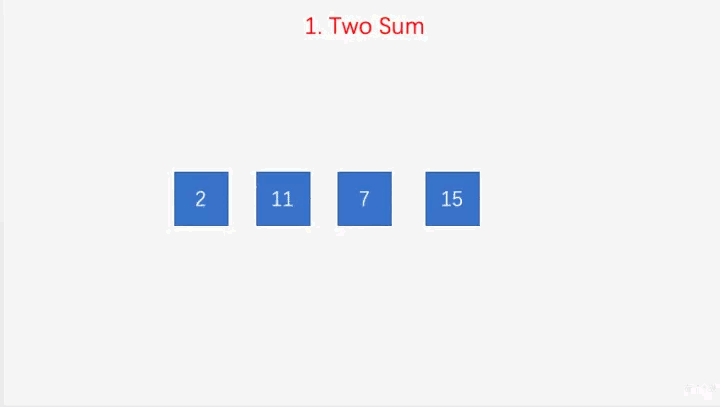

给定一个整数数组 nums 和一个目标值 target，请你在该数组中找出和为目标值的那 两个 整数，并返回他们的数组下标。

你可以假设每种输入只会对应一个答案。但是，你不能重复利用这个数组中同样的元素。  

示例：
```md
给定 nums = [2, 7, 11, 15], target = 9

因为 nums[0] + nums[1] = 2 + 7 = 9
所以返回 [0, 1]
```


## 方法一：两层循环遍历
```js
var twoSum = function(nums, target) {
 for (let i = 0; i < nums.length; i++) {
   for (let j = i + 1; j < nums.length; j++) {
     if(nums[i] + nums[j] === target) {
       return [i, j]
     }
   }
 }
};
// 执行用时 :132 ms, 在所有 JavaScript 提交中击败了45.08%的用户
// 内存消耗 :34.8 MB, 在所有 JavaScript 提交中击败了57.44%的用户
```
时间复杂度；On²。<br/>
空间复杂度：O1 

## 方法二：利用对象做一层映射
1.创建一个空对象<br/>
2.每次循环判断obj[target - nums[i]]是否有值<br/>
3.每次循环将num[i]作为key，index作为值存入obj。<br/>

动画演示  



举例：
```md
给定 nums = [2, 7, 11, 15], target = 13;

第一次循环：obj[target - nums[i]] = undefined, obj = { 2: 1 };
第二次循环：obj[target - nums[i]] = undefined, obj = { 2: 1， 7：1 };
第三次循环：obj[target - nums[i]] = 0, return [0, 2]

```

最终代码：
```js
var twoSum = function(nums, target) {
  let obj = {};
  for (let i = 0; i < nums.length; i++) {
    // 注意这里不能用obj[target - nums[i]] !== 'undefined'来判断，
    // 因为obj[target - nums[i]] = 0时，if判断为false
    if(typeof (obj[target - nums[i]]) !== 'undefined') {
      return [obj[target - nums[i]], i]
    }
    obj[nums[i]] = i;
  }
};
// 执行用时 :64 ms, 在所有 JavaScript 提交中击败了89.09%的用户
// 内存消耗 :34.3 MB, 在所有 JavaScript 提交中击败了90.36%的用户
```
时间复杂度：On <br/>
空间复杂度：On

## 总结
使用第二种方法可以减少一层for循环。时间复杂度也从On²降到了On
