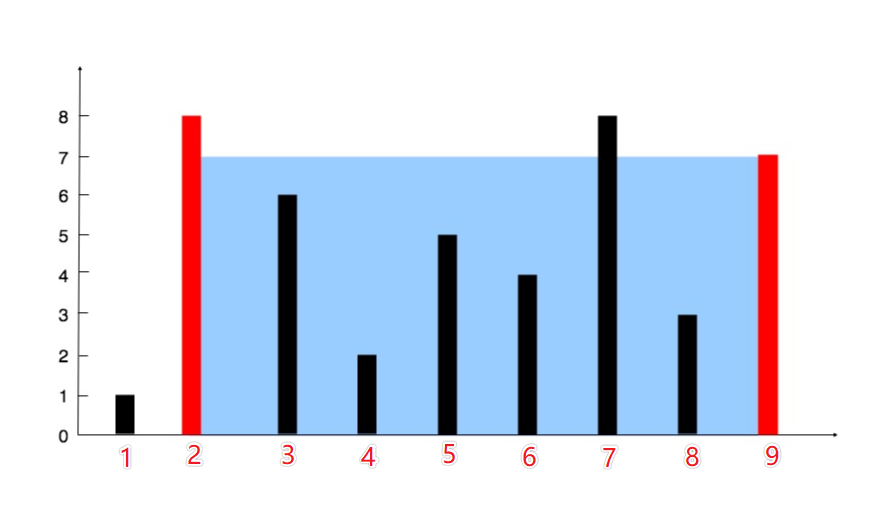

给你 n 个非负整数 a1，a2，...，an，每个数代表坐标中的一个点 (i, ai) 。在坐标内画 n 条垂直线，垂直线 i 的两个端点分别为 (i, ai) 和 (i, 0)。找出其中的两条线，使得它们与 x 轴共同构成的容器可以容纳最多的水。

说明：你不能倾斜容器，且 n 的值至少为 2。<br/>

图中垂直线代表输入数组 [1,8,6,2,5,4,8,3,7]。在此情况下，容器能够容纳水（表示为蓝色部分）的最大值为 49。

示例：
```md
输入：[1,8,6,2,5,4,8,3,7]
输出：49
```

## 解题思路
容器的容积 = 底面积 * 高（这里看成二维的，底面积=底） <br/>
我们不妨给x轴也标上坐标<br/>

容器最大体积 = (9-2) * 7 = 49

思路如下：
- 1、定义max变量，用于存储最大体积
- 2、两次循环，底=j-i，高=Math.min(height[i], height[j])
- 3、当前容积和已知最大容积比较，获取最大值

## 实现代码
方法一：暴力法，两层循环
```js
var maxArea = function(height) {
  // 1、定义max变量，用于存储最大体积
  let max = 0;
  for (let i = 0; i < height.length; i++) {
    for (let j = i + 1; j < height.length; j++) {
      // 获取最小高度
      let min = Math.min(height[i], height[j]);
      // 获取最大值
      max = Math.max((j-i)*min, max)
    }
  }
  return max;
};
// 执行用时：752 ms, 在所有 JavaScript 提交中击败了28.78%的用户
// 内存消耗：36.1 MB, 在所有 JavaScript 提交中击败了23.53%的用户
// 时间复杂度：On²
// 空间复杂度：O1
```
方法二：参考官网双指针法<br/>
思路：<br/>
你肯定听说过，一个桶能装多少水取决于最短那根木板的长度，这里的双指针法就是这个思想，一直去移动较短的那端
- 1、创建首尾双指针i,j
- 2、判断height[i]和height[j]的大小，如果height[i] < height[j]，按照上面思路，移动较短的，i++,反之j++
- 3、获取容积，和max判断大小
```js
var maxArea = function (height) {
  // 创建一前一后双指针i,j
  let i = 0;
  let j = height.length - 1;
  let max = 0;
  while(i < j) {
    // 判断左右两根柱子哪个高，移动较短的那根
    if(height[i] < height[j]) {
      // 获取容积max值
      max = Math.max((height[i] * (j-i)), max)
      i++
    } else {
      max = Math.max((height[j] * (j-i)), max)
      j--
    }
  }
  return max
};
// 执行用时 :72 ms, 在所有 JavaScript 提交中击败了78.94%的用户
// 内存消耗 :36.7 MB, 在所有 JavaScript 提交中击败了11.76%的用户
// 时间复杂度：On
// 空间复杂度：O1
```