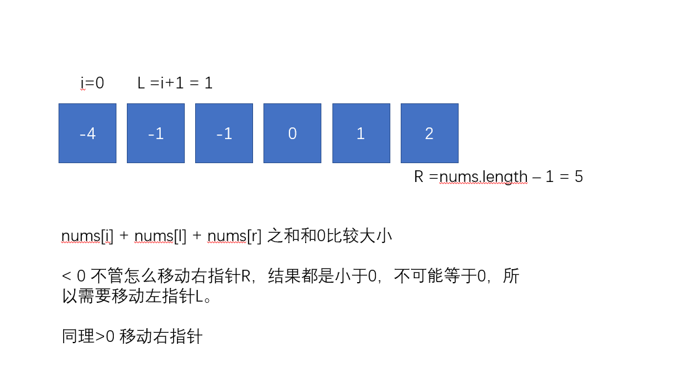
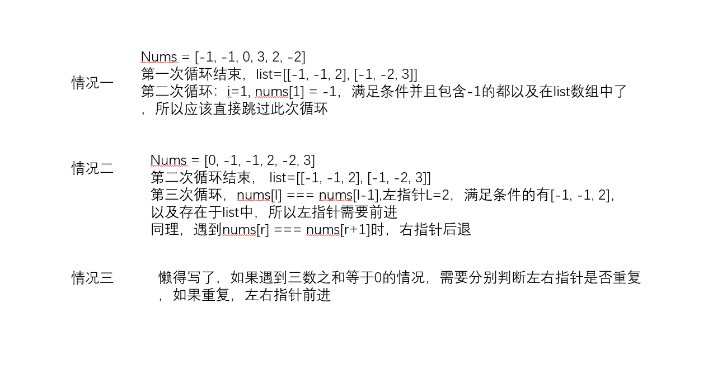

给你一个包含 n 个整数的数组 nums，判断 nums 中是否存在三个元素 a，b，c ，使得 a + b + c = 0 ？请你找出所有满足条件且不重复的三元组。

注意：答案中不可以包含重复的三元组。

示例：
```md
给定数组 nums = [-1, 0, 1, 2, -1, -4]，

满足要求的三元组集合为：
[
  [-1, 0, 1],
  [-1, -1, 2]
]
```
## 方法一：暴力法三层循环
```js
var threeSum = function (nums) {
  let list = [];
  for (let i = 0; i < nums.length - 2; i++) {
    for (let j = i + 1; j < nums.length - 1; j++) {
      for (let x = j + 1; x < nums.length; x++) {
        if (nums[i] + nums[j] + nums[x] === 0) {
          list.push([nums[i], nums[j], nums[x]]);
        }
      }
    }
  }
  // 这里还需要做一下二维数组的去重
  return list;
};
```
上面方法时间复杂度已经达到On³了，肯定是不推荐的，正常而言超过On²复杂度的算法都要考虑优化。

## 方法二：双指针中的对撞指针法
思路如下：
- 1、给定数组 nums = [-1, 0, 1, 2, -1, -4]
- 2、对nums进行排序, 排序后 nums = [ -4, -1, -1, 0, 1, 2 ]
- 3、定义一前一后双指针l,r
- 4、nums[i] + nums[l] + nums[r]的值和0判断
- 5、小于0，移动左指针l，大于0移动右指针r

画图展示如下：<br/>


代码如下：
```js
/**
 * @param {number[]} nums
 * @return {number[][]}
 */
var threeSum = function (nums) {
  // 1.排序
  nums.sort((a, b) => {
    return a - b;
  });
  // nums = [ -4, -1, -1, 0, 1, 2 ]
  // 定义数组，存放结果
  let list = [];
  // 因为左右指针会遍历后面两个数，所以这里遍历到后三位就行，-2
  for (let i = 0; i < nums.length - 2; i++) {
    // 定义左右指针
    let l = i + 1;
    let r = nums.length - 1;
    // 左右指针分别像中间靠拢，也就是俗称的对撞指针
    while (r > l) {
      // 三数之和小于0，左指针前进
      if (nums[i] + nums[l] + nums[r] < 0) {
        l++;
        while(nums[l] === nums[l-1]) {
          l++
        }
      } else if (nums[i] + nums[l] + nums[r] > 0) {
        // 三数之和大于0，右指针后退
        r--;
        while(nums[r] === nums[r+1]) {
          r--
        }
      } else {
        // 三数之和等于0，push进list数组
        list.push([nums[i], nums[l], nums[r]]);
        // 左右指针同时移动
        l++;
        r--;
      }
    }
  }
  return list;
};
nums = [-1, 0, 1, 2, -1, -4];
threeSum(nums)  // [ [ -1, -1, 2 ], [ -1, 0, 1 ], [ -1, 0, 1 ] ]
// 时间复杂度：O(nlogn), logn来自while循环，n来自for循环
// 空间复杂度：On
```
上面虽然筛选出来了符合条件的二维数组，但是答案中出现了重复项，我们需要想办法去掉

重复情况分析：<br/>


代码如下：
```js
var threeSum = function (nums) {
  nums.sort((a, b) => {
    return a - b;
  });
  let list = [];
  for (let i = 0; i < nums.length - 2; i++) {
    let l = i + 1;
    let r = nums.length - 1;
    // 情况一：nums[i] === nums[i-1]
    if (nums[i] === nums[i - 1]) {
      continue;
    }
    while (r > l) {
      if (nums[i] + nums[l] + nums[r] < 0) {
        l++;
        // 情况二：左指针重复
        while (nums[l] === nums[l - 1]) {
          l++;
        }
      } else if (nums[i] + nums[l] + nums[r] > 0) {
        r--;
        // 情况二：右指针重复
        while (nums[r] === nums[r + 1]) {
          r--;
        }
      } else {
        list.push([nums[i], nums[l], nums[r]]);
        l++;
        r--;
        // 情况三：左右指针重复判断
        while (nums[l] === nums[l - 1]) {
          l++;
        }
        while (nums[r] === nums[r + 1]) {
          r--;
        }
      }
    }
  }
  return list;
};
// 执行用时：184 ms, 在所有 JavaScript 提交中击败了62.03%的用户
// 内存消耗：46.4 MB, 在所有 JavaScript 提交中击败了100.00%的用户
// 复杂度和上面一样
```