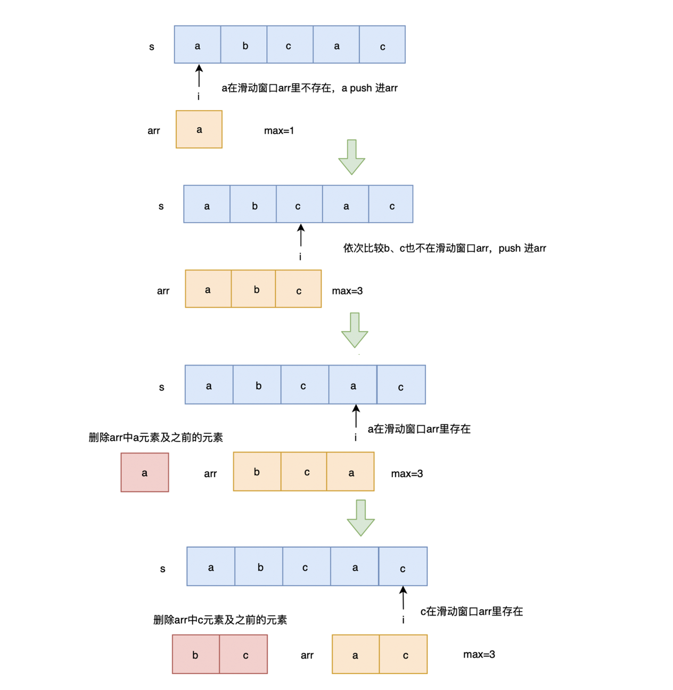

## 题目
给定一个字符串，请你找出其中不含有重复字符的 最长子串 的长度。

示例 1:
```md
输入: "abcabcbb"
输出: 3 
解释: 因为无重复字符的最长子串是 "abc"，所以其长度为 3。
```
示例 2:
```md
输入: "bbbbb"
输出: 1
解释: 因为无重复字符的最长子串是 "b"，所以其长度为 1。
```
示例 3:
```md
输入: "pwwkew"
输出: 3
解释: 因为无重复字符的最长子串是 "wke"，所以其长度为 3。
     请注意，你的答案必须是 子串 的长度，"pwke" 是一个子序列，不是子串。
```

## 解题思路
这题自己没想出来，最后还是看的解题，简单说明一下滑动数组这种方法的实现思路。
- 1、维护一个滑动数组。
- 2、遍历字符串，判断字符是否在滑动数组中，不在则push进滑动数组，在则将存在下标以及前面的元素都切掉，并且将当前元素push进滑动数组。
- 3、更新max长度。

借用别人的一张图来更好的理解：<br/>


## 实现代码
```js
var lengthOfLongestSubstring = function (s) {
  // 滑动数组
  let arr = [];
  let max = 0;
  for (let i = 0; i < s.length; i++) {
    let index = arr.indexOf(s[i]);
    if (index !== -1) {
      // arr = [ 'a', 'b', 'c' ], s[i] = 'a'
      arr.splice(0, index + 1);
      // arr = [ 'b', 'c' ]
    }
    arr.push(s[i]);
    // arr = [ 'b', 'c', 'a' ]
    max = Math.max(arr.length, max);
  }
  return max;
};
let str = 'abcabcbb';
lengthOfLongestSubstring(str);
```
执行用时：108 ms, 在所有 JavaScript 提交中击败了58.08%的用户 <br />
内存消耗：39.3 MB, 在所有 JavaScript 提交中击败了64.38%的用户 <br />

时间复杂度：On²， indexOf复杂度On，组合就是On² <br/>
空间复杂度：On

## 其它方案
Map方案: <br/>
使用 map 来存储当前已经遍历过的字符，key 为字符，value 为下标

使用 i 来标记无重复子串开始下标，j 为当前遍历字符下标

遍历字符串，判断当前字符是否已经在 map 中存在，存在则更新无重复子串开始下标 i 为相同字符的下一位置，此时从 i 到 j 为最新的无重复子串，更新 max ，将当前字符与下标放入 map 中

最后，返回 max 即可
```js
var lengthOfLongestSubstring = function (s) {
  let map = new Map(),
    max = 0;
  for (let i = 0, j = 0; j < s.length; j++) {
    if (map.has(s[j])) {
      i = Math.max(map.get(s[j]) + 1, i);
    }
    max = Math.max(max, j - i + 1);
    map.set(s[j], j);
  }
  return max;
};
```
时间复杂度：On <br/>
空间复杂度：On