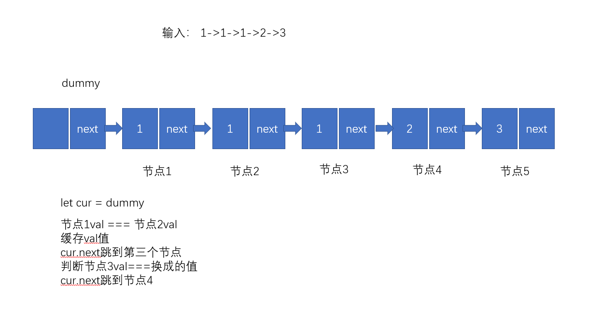

[原题地址](https://leetcode-cn.com/problems/remove-duplicates-from-sorted-list-ii/)

给定一个排序链表，删除所有含有重复数字的节点，只保留原始链表中 没有重复出现 的数字。

示例 1:
```md
输入: 1->2->3->3->4->4->5
输出: 1->2->5
```
示例 2:
```md
输入: 1->1->1->2->3
输出: 2->3
```

## 分析
看这题之前可以先看一下[83.删除排序链表中的重复元素](./83.删除排序链表中的重复元素)，83题是删掉重复的元素，但是会留一个，这题是全删了，难就难在重复的元素一个不留全删了。

简单画个图说明一下：


思路：
- 1、在头节点前定义一个假节点dummy，指针cur指向dummy。
- 2、判断下一个节点和下下个节点val值是否相等，也就是判断图中dummy后面俩节点值是否相同。
- 3、比如第一个节点和第二个节点val相同，保留val值继续往后判断，如果判断第三个节点值和val相同，继续往后走，走到第四个节点，val的值和前三个不用，则将dummy的next指针知道第四个节点位置。这样就完成了重复节点的删除。

## 实现代码
```js
/**
 * Definition for singly-linked list.
 * function ListNode(val) {
 *     this.val = val;
 *     this.next = null;
 * }
 */
/**
 * @param {ListNode} head
 * @return {ListNode}
 */
var deleteDuplicates = function (head) {
  // dummy假节点初始化
  let dummy = new ListNode();
  // next指针指向头节点
  dummy.next = head;
  // cur指针
  let cur = dummy;
  // cur指针后面至少的有俩节点。
  while (cur.next && cur.next.next) {
    // 下个节点和下下个节点val相同
    if (cur.next.val === cur.next.next.val) {
      // 记录重复的值
      let val = cur.next.val;
      // 跨过这俩相同节点，cur.next指向第三个节点
      cur.next = cur.next.next.next;
      // 继续判断第三个节点val是否等于缓存节点的值，等于继续往后跳
      while (cur.next && cur.next.val === val) {
        cur.next = cur.next.next;
      }
    } else {
      cur = cur.next;
    }
  }
  return dummy.next;
};
// 执行用时：84 ms, 在所有 JavaScript 提交中击败了44.78%的用户
// 内存消耗：36.5 MB, 在所有 JavaScript 提交中击败了50.00%的用户
// 时间复杂度：On
// 空间复杂度：O1
```